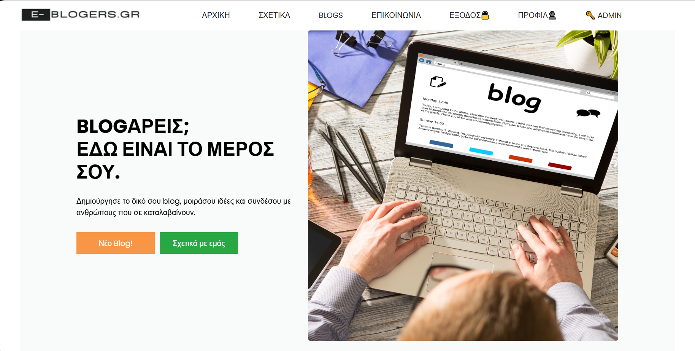
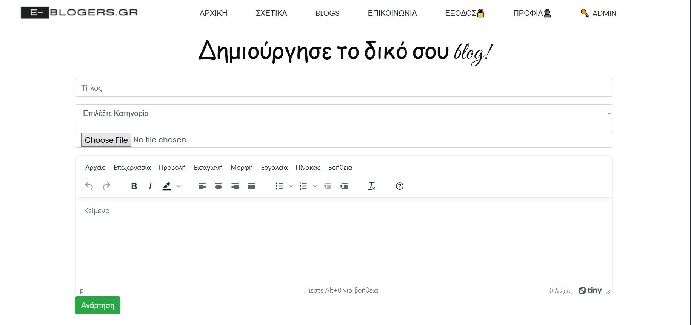
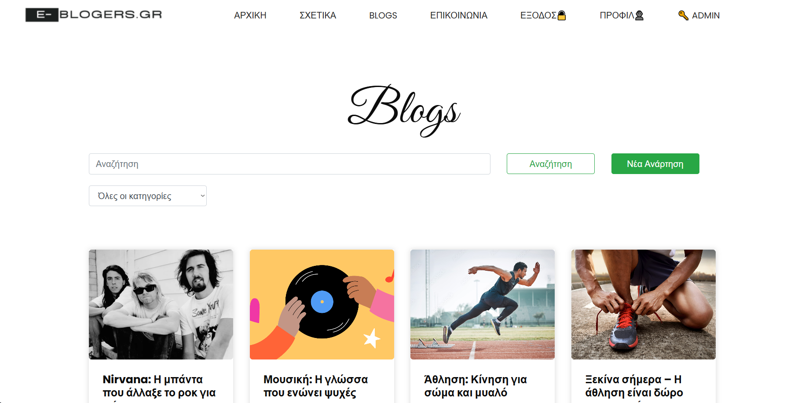
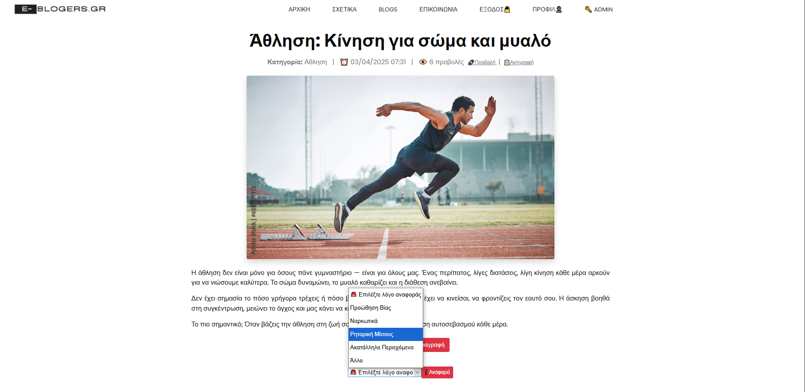
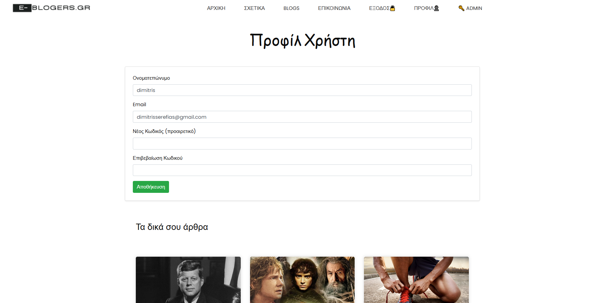
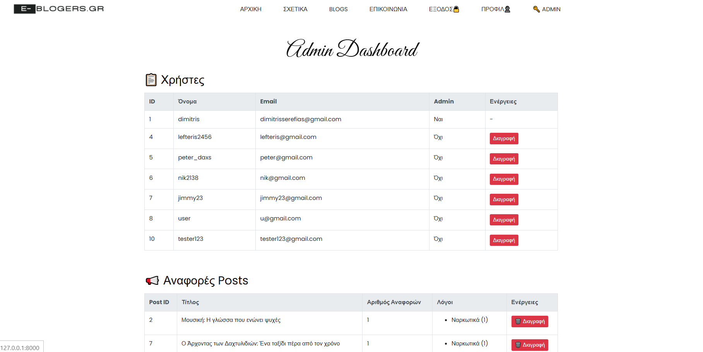

# 📝 MyLaravelBlog

Καλώς ήρθατε στο προσωπικό μου blog project!  
Πρόκειται για μια Laravel εφαρμογή όπου οι χρήστες μπορούν να δημιουργούν, επεξεργάζονται και διαβάζουν άρθρα blog με όμορφη παρουσίαση και δυναμική διαχείριση περιεχομένου. Όλα τα δεδομένα αποθηκεύονται σε μία βάση δεδομένων που εχω δημιουργήσει με την βοήθεια της PHP.

---

## 🔧 Τεχνολογίες

- Laravel 10
- Blade Templates
- Bootstrap 5
- TinyMCE Editor
- FontAwesome
- Purifier (για καθαρό HTML input)

---

## ✨ Βασικές Λειτουργίες

- ✅ Δημιουργία λογαριασμού (Register) και σύνδεση μέσω του κωδικού (Login)
- ✅ Ο κάθες χρήστης μπορεί να επεξεργαστεί μόνο τα δικά του blogs
- ✅ Για την προβολή και συγγραφή ενός blog απαιτείται σύνδεση
- ✅ Δημιουργία και επεξεργασία blog posts με WYSIWYG editor (TinyMCE)
- ✅ SEO-friendly URLs με slugs
- ✅ Κατηγοριοποίηση άρθρων
- ✅ Σύστημα αναζήτησης με λέξεις-κλειδιά και φίλτρο κατηγορίας
- ✅ Εμφάνιση προβολών ανά άρθρο αλλά και ημερομηνίας ανάρτησης.
- ✅ Responsive UI με όμορφα cards και layouts
- ✅ Σελίδα "Επικοινωνία" με φόρμα και email υποστήριξης
- ✅ Κάθε χρήστης μπορεί να βλέπει και να επεξεργάζεται το προφίλ του (όνομα, email, bio κ.λπ.)
- ✅Όμορφο dashboard admin για καλύτερη διαχείριση της ιστοσελίδας.
- ✅ Αποτροπή υβριστικών σχολίων και ακατάλληλου περιεχομένου με την χρήση API
- ✅ Δυνατότητα αναφοράς post από τους χρήστες. Τα reports έπειτα στέλνονται στο panel του admin.

---

## 📸 Screenshots

### 🏠 Αρχική Σελίδα Blog



---

### 📝 Δημιουργία Νέου Άρθρου



---

### 👁️ Σελίδα Προβολής blogs


---
### 🗏 Σελίδα Προβολής για το κάθε blog


---
### 🖥️ Σύνδεση στον ιστότοπο


---
### 📬 Σελίδα Επικοινωνίας


---
### 👤 Προφίλ χρήστη



---
### 🤖 Admin dashboard


---
## 🚀 Οδηγίες Εγκατάστασης (τοπικά)

```bash
git clone https://github.com/jimsere/MyLaravelBlog.git
cd MyLaravelBlog
composer install
cp .env.example .env
php artisan key:generate
php artisan migrate
php artisan serve
```
---

## 🚧 Μελλοντικές Αλλαγές

- ❤️ Δυνατότητα "like" σε posts από άλλους χρήστες  
  Οι χρήστες θα μπορούν να κάνουν like σε άρθρα άλλων και να φαίνεται ο αριθμός likes σε κάθε post.

---

## 📬 Επικοινωνία
Για ερωτήσεις ή προτάσεις: 📧 dimitrisserefias@gmail.com
🌍 Θεσσαλονίκη, Ελλάδα

---

## 🖤 Ευχαριστώ!
Αν σου άρεσε το project, κάνε ένα ⭐ στο repo!
